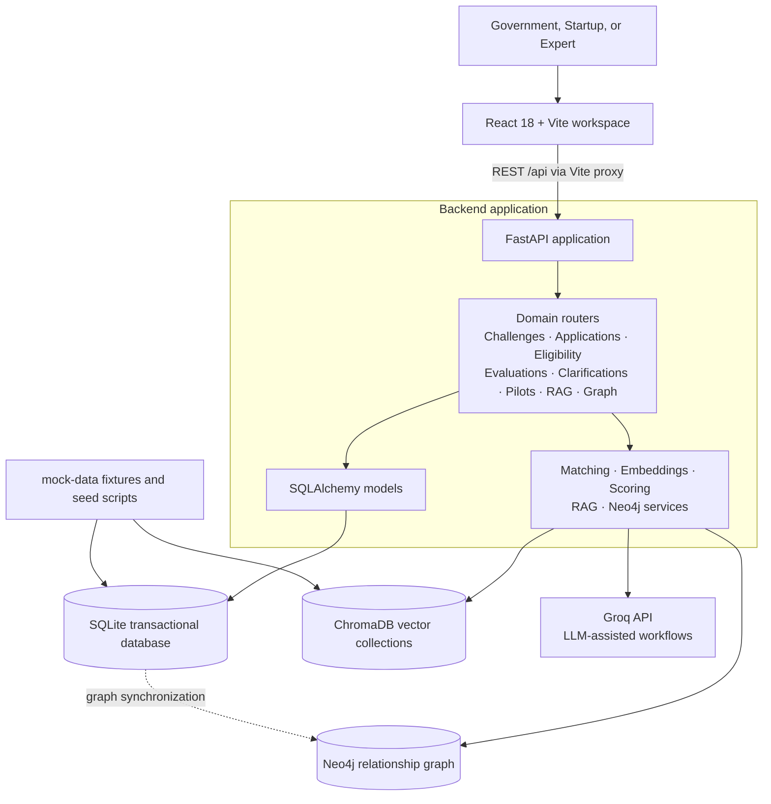
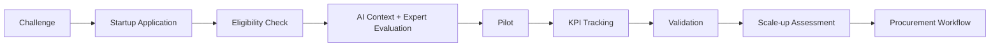

# MAITRI

**Maharashtra Accelerator for Innovation, Technology & Research Impact** is a full-stack prototype connecting public-sector challenges with startup solutions and expert review. It supports a shared delivery lifecycle from challenge discovery through application, evaluation, pilots, KPI validation, scale-up, and procurement tracking.

> MAITRI is an innovation-workflow prototype. Workspace role selection is for demonstration and is not production authentication or authorization.

## What the Project Does

Government teams can turn public problems into challenges, publish opportunities, review startup applications, and follow pilots and outcomes. Startups can discover and save challenges, check eligibility, apply, respond to clarification requests, and track pilots and impact. Experts can review applications, submit technical scorecards, request clarifications, and review pilot evidence within a separate workspace.

The workspaces use the same underlying challenge, startup, application, evaluation, pilot, and KPI records. Some prototype-only profile, review, and uploaded-document metadata is stored in the browser rather than a production file or identity service.

## Features

- **Challenge lifecycle:** Capture department problems, draft and publish challenges, and expose public requirements, budgets, and timelines.
- **Startup discovery and matching:** Search published challenges, compare sector and technology fit, and use semantic startup matching through the backend matching service.
- **Eligibility checks:** Evaluate challenge rules such as TRL, certifications, government experience, deployment capacity, and sector compatibility with explicit results.
- **Startup applications:** Complete an eight-step application, save drafts, attach supporting documents, track status, and view the application timeline.
- **Expert evaluation:** Provide an AI-assisted assessment as reference context, record expert scores and comments, and request startup clarification. AI-generated scores do not themselves approve an application.
- **Pilot delivery and impact:** Track pilots, milestones, KPI baseline/target/current values, evidence metadata, and validation/scale-up information.
- **Policy assistance and graph exploration:** Retrieve policy context from the knowledge collection and explore department/problem/challenge/startup relationships.
- **Role-specific workspaces:** Government, Startup, and Expert have separate navigation and task surfaces. Authentication and fine-grained server-side role authorization are not implemented in this prototype.

## Technology Stack

| Area | Technology |
| --- | --- |
| Frontend | React 18, Vite 5, React Router 6, Tailwind CSS 3, Recharts, Lucide |
| Backend | Python, FastAPI, Pydantic Settings, SQLAlchemy |
| Transactional data | SQLite (swappable via `DATABASE_URL`) |
| Semantic search / retrieval | ChromaDB, local embedding service |
| Relationship graph | Neo4j 5 |
| Language model | Groq API for supported generation and summarization workflows |
| Local orchestration | Docker Compose for Neo4j; frontend and API run on the host |

## System Architecture



### Core Workflow



## Repository Layout

```text
backend/       FastAPI app, models, routers, services, and seed scripts
frontend/      React application, role workspaces, and shared UI components
mock-data/     Synthetic JSON data used by the prototype seeders
data/chroma/       Local persistent ChromaDB data
docker-compose.yml Neo4j service for local development
```

## Local Setup

### Requirements

- Python 3.11 or newer
- Node.js 18 or newer and npm
- Docker Desktop (for Neo4j-backed graph features)
- A Groq API key for LLM-backed features; deterministic and non-LLM workflows can be explored without it

### Configure and seed the backend

From the repository root, in PowerShell:

```powershell
cd backend
py -m venv .venv
.\.venv\Scripts\Activate.ps1
pip install -r requirements.txt
Copy-Item ..\envexample .env
```

Set `GROQ_API_KEY` in `backend/.env` if you want to use Groq-backed features. Keep real credentials in local `.env` files; never commit them.

Start Neo4j and seed the local data from the repository root:

```powershell
cd ..
docker compose up -d neo4j
cd backend
python -m app.seed.seed_db
python -m app.seed.seed_chroma
python -m app.seed.seed_neo4j
```

Run the API from `backend/`:

```powershell
uvicorn app.main:app --reload --port 8000
```

The API documentation is available at `http://localhost:8000/docs`.

### Run the frontend

In a second terminal:

```powershell
cd frontend
npm install
npm run dev
```

Vite uses port `5173` in strict-port mode. Open `http://localhost:5173/`.

## Render Deployment

Create a Render Blueprint from this repository and select `render.yaml`. It defines one Python web service. Render installs the backend requirements, builds the Vite app into `frontend/dist`, and starts `app.main:app` on Render's `$PORT`. FastAPI serves the built frontend and React routes from that service; API endpoints remain under `/api/`.

| Environment variable | Render configuration | Requirement |
| --- | --- | --- |
| `PORT` | Supplied by Render and passed to Uvicorn as `$PORT` | Managed by Render; do not set manually |
| `RENDER_EXTERNAL_URL` | Supplied by Render and referenced by the Blueprint | Managed by Render; provides the same-origin URL for CORS and the Vite API base URL |
| `PYTHON_VERSION` | Set to `3.11.11` in `render.yaml` | Managed by the Blueprint |
| `DATABASE_URL` | Defaults to `sqlite:///./maitri.db` | SQLite works for a demo but is ephemeral on Render; use a managed database for durable data |
| `CHROMA_PERSIST_DIR` | Set to `/tmp/chroma` in `render.yaml` | Chroma data is ephemeral on Render |
| `CORS_ORIGINS` | Set from the service's `RENDER_EXTERNAL_URL` | Managed by the Blueprint; no manual value needed for the single-origin deployment |
| `VITE_API_BASE_URL` | Set from the service's `RENDER_EXTERNAL_URL` during the frontend build | Managed by the Blueprint; the frontend also defaults to same-origin requests |
| `GROQ_API_KEY` | Enter as a Render secret when prompted | Needed for Groq-backed features; the API can start without it |
| `GROQ_MODEL` | Defaults to `llama-3.1-70b-versatile` | Optional override |
| `NEO4J_URI`, `NEO4J_USER`, `NEO4J_PASSWORD` | Defaults target local development Neo4j | Needed for graph features in production; configure a reachable Neo4j instance in Render |

## Demo Data and Limitations

- Seed data is synthetic and intended for local demos and evaluation.
- The backend is the shared source for core application entities. Some expert scorecards, profile overrides, and document metadata are prototype-local browser data.
- The landing page role selector does not authenticate users. Production use requires identity, server-side role enforcement, file storage, and access-controlled assignment/payment services.
- Contract and payment details appear only when present in the data; the prototype does not fabricate financial records.

## Security Notes

- `backend/.env` is ignored by Git. Use the root `envexample` only as a blank configuration template.
- Do not put API keys, passwords, access tokens, or private deployment details in source files, screenshots, or commits.
- Rotate credentials immediately if they have ever been committed or shared publicly.
